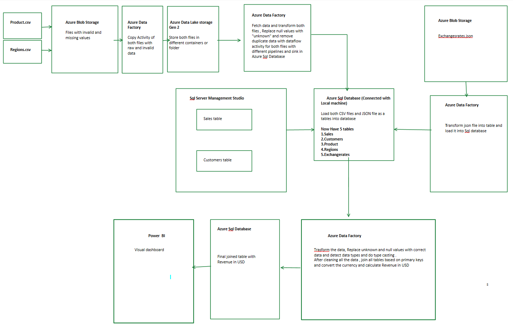
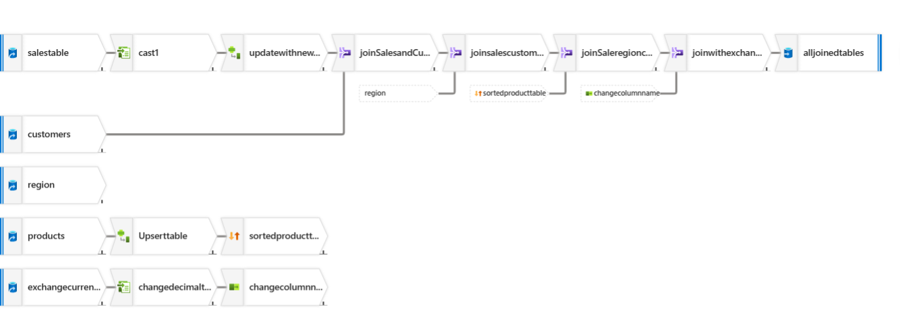
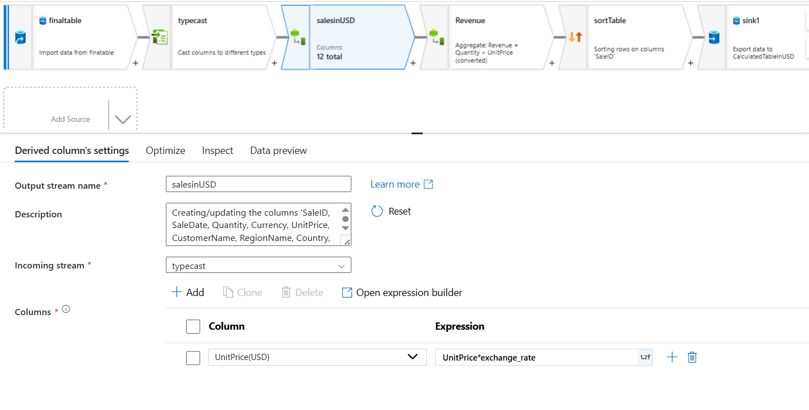
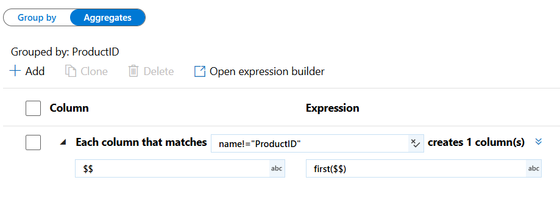
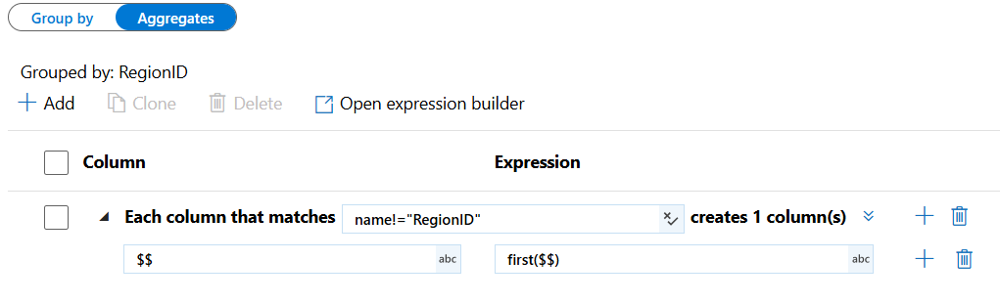
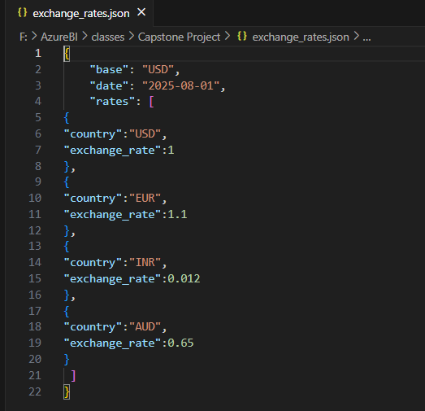
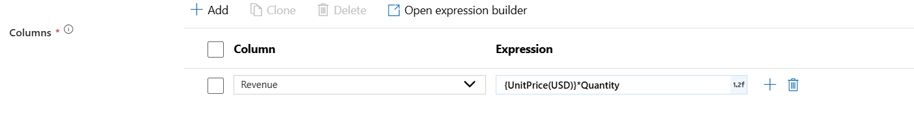
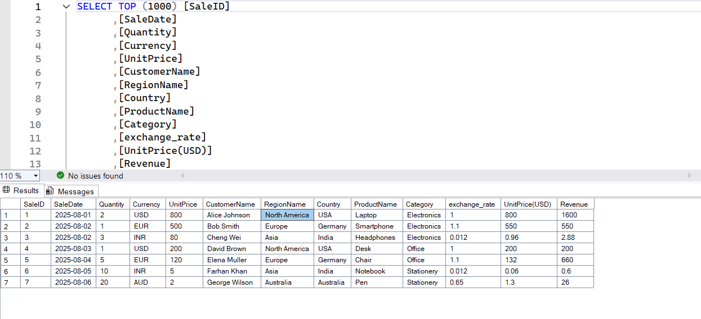
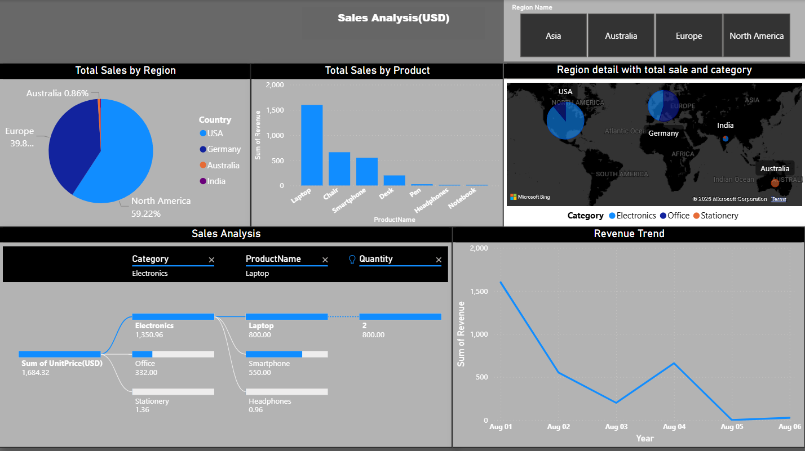

<div align="center">
  
  <h1>Sales Analysis – Azure Data Factory & Power BI</h1>
  <p><b>End-to-end ETL pipeline for automated sales data processing, USD currency conversion, SQL integration, and Power BI reporting.</b></p>

  
  
  
  
  
</div>

---

## 📌 Project Overview

The **Sales Analysis** project implements a centralized data engineering and analytics workflow using **Azure Data Factory (ADF)**. The solution collects sales-related data from multiple sources and formats, moves raw data into **Azure Data Lake Storage Gen2**, performs data-quality and transformation operations, integrates exchange-rate information, converts international sales values into **USD**, and delivers a curated dataset for **Power BI** reporting.

The project addresses fragmented data, inconsistent formats, missing/duplicate records, multiple currencies, and manual reporting processes.

---

## 🏗️ Architecture

The end-to-end solution follows this workflow:

```text
Azure Blob Storage
        │
        ▼
Azure Data Factory
        │
        ▼
ADLS Gen2 – Raw Data
        │
        ├───────────────┬────────────────┐
        ▼               ▼                ▼
 Product Data Flow   Region Data Flow   JSON / Exchange Rate
        │               │                │
        └───────────────┴────────────────┘
                        │
                        ▼
               Data Quality Checks
                        │
               ┌────────┴────────┐
               │                 │
        Missing Values     Duplicate Records
               │                 │
               └────────┬────────┘
                        ▼
                Azure SQL Database
                        │
                        ▼
              Data Integration / Joins
                        │
                        ▼
             Exchange Rate Integration
                        │
                        ▼
              Currency Conversion to USD
                        │
                        ▼
                 Derived Calculations
                        │
                        ▼
                 Curated Sales Table
                        │
                        ▼
              SQL Server / SSMS
              (Self-Hosted IR)
                        │
                        ▼
                    Power BI
```

### Architecture Screenshot



---

## 🔄 ETL Workflow

### 1. Extract

Source data is collected from:

- Azure Blob Storage
- CSV files
- JSON files
- Azure SQL Database
- SQL Server / SSMS

The **Product.csv** and **Regions.csv** files are extracted from Azure Blob Storage using ADF Copy Activity and migrated into ADLS Gen2.



### 2. Load Raw Data into ADLS Gen2

ADLS Gen2 acts as the centralized data-lake layer for raw and processed data. ADF pipelines orchestrate the movement of source data into the lake before transformation.



### 3. Transform Product Data

The Product dataset is processed using an ADF Mapping Data Flow.

Key transformations include:

- Handling missing values
- Removing duplicate ProductID records
- Aggregating records by ProductID
- Applying appropriate data types
- Loading the cleansed dataset through a Sink transformation



### 4. Transform Region Data

The Region dataset follows a similar transformation process:

- Remove duplicate RegionID records
- Remove missing/invalid records
- Apply data-type transformations
- Load the cleansed data into the target tables



---

## 💱 Currency Conversion to USD

International sales are standardized into USD by integrating the **Exchange Rate** data with the Sales dataset.

The project uses USD as the base currency. The documented exchange-rate examples include:

| Currency | Exchange Rate |
|---|---:|
| USD | 1.00 |
| EUR | 1.10 |
| INR | 0.012 |
| AUD | 0.65 |



### Currency Conversion Formula

```text
Sales in USD = Sales Amount × Applicable Exchange Rate
```

The Exchange Rate table is joined to the Sales data using the relevant currency key, and the resulting USD value is used for standardized reporting and downstream calculations.

---

## 🧮 Derived Calculations

The integrated dataset is used to create business calculations after the required joins and currency transformation.

### Revenue Calculation

```text
Revenue = UnitPrice (USD) × Quantity
```



The USD-standardized unit price allows revenue to be analyzed consistently across international sales data.

---

## 🗄️ SQL Integration

After transformation and calculation, the curated sales dataset is loaded into the SQL environment. The project uses a **Self-Hosted Integration Runtime** to support data movement between the Azure environment and the on-premises SQL Server/SSMS environment.



---

## ⏰ Pipeline Automation

The ADF workflow is scheduled to run automatically:

**Every Monday at 9:00 AM**

This scheduled trigger automates the recurring ETL process and reduces manual data-processing activities.

---

## 📊 Power BI Dashboard

The final curated dataset is connected to Power BI to provide interactive sales analysis.

The dashboard includes analysis such as:

- Total Sales by Product
- Total Sales by Country
- Total Sales by Customer
- Products Sold by Category
- Sales by Region
- Sales trends
- Sales standardized in USD



---

## 🧩 Data Modeling

The project uses a **snowflake schema** to organize relationships between fact and dimension tables.

Typical analytical entities include:

- Sales fact data
- Product dimension
- Region dimension
- Customer-related data
- Currency / Exchange Rate data

This structure supports analytical queries and Power BI reporting across products, regions, countries, and customers.

---

## 🛠️ Technology Stack

| Technology | Purpose |
|---|---|
| **Azure Data Factory** | ETL orchestration and pipeline automation |
| **Azure Blob Storage** | Source/raw data storage |
| **Azure Data Lake Storage Gen2** | Centralized data-lake storage |
| **Azure SQL Database** | Staging and transformed data |
| **SQL Server / SSMS** | On-premises database integration |
| **Self-Hosted Integration Runtime** | Cloud-to-on-premises connectivity |
| **Power BI** | Dashboard and visualization |
| **DAX** | Analytical calculations |
| **Azure DevOps** | Project/development management |

---

## 📁 Repository Structure

```text
Sales-Analysis/
│
├── README.md
├── assets/
│   ├── logo.jpeg
│   ├── architecture.png
│   ├── adf_pipeline.png
│   ├── adf_ingestion.png
│   ├── product_aggregation.png
│   ├── region_aggregation.png
│   ├── exchange_rate_json.png
│   ├── revenue_formula.png
│   ├── sql_output.png
│   └── powerbi_dashboard.png
│
└── FinalSalesReport.pbix   # Add the PBIX file if you want to publish it in the repository
```

---

## 🎯 Key Outcomes

- Centralized sales ETL workflow using Azure Data Factory.
- Automated ingestion and transformation of multi-format data.
- Improved data quality through missing-value and duplicate-record handling.
- Integrated exchange-rate information for international sales.
- Standardized sales values into USD.
- Created curated data for downstream analytics.
- Automated weekly pipeline execution.
- Delivered interactive Power BI dashboards for sales analysis.

---

## 👤 Project Information

**Project:** Sales Analysis Report  
**Domain:** Data Engineering & Business Intelligence  
**Primary Tools:** Azure Data Factory, ADLS Gen2, Azure SQL, SQL Server, Power BI

---

## 📄 Source Documentation

This README is based on the supplied **Sales Analysis** project documentation and implementation screenshots. The workflow includes the documented ADF pipelines, data-quality transformations, exchange-rate integration, USD conversion, SQL loading, scheduled automation, and Power BI reporting.

---

<div align="center">
  <b>Sales Analysis | Azure Data Engineering & Business Intelligence</b>
</div>
